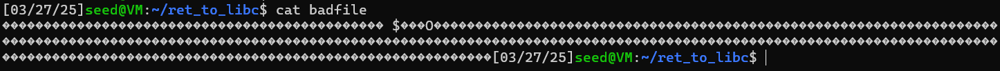

Before starting we set up the seedVM according to the instructions and uploaded the resource data to the VM.

## Step 1
use make to compile the c program 
Using make, we compiled the c program with gcc to the executable. 
We then run ```gdb ./retlib```. We set a breakpoint in the bof function with ```break bof``` and finally run the program with ```run```.
The breakpoint is reached at the bof() function and we can now run ```print system``` and ```print exit``` which will print information about the system() and exit() functions. The output is as follows:
```
$2 = {<text variable, no debug info>} 0xf7e12420 <system>
$3 = {<text variable, no debug info>} 0xf7e04f80 <exit>
```
as we can see the addresses of the system() and exit() functions are at 0xf7e12420 and 0xf7e04f80 respectively.

## Step2
We set the MYSHELL environment variable to "/bin/sh" with ```export MYSHELL=/bin/sh``` and verify that it worked with ```env | grep MYSHELL```:
```
MYSHELL=/bin/sh
```
using this program in prtenv.c:
```c
#include <stdio.h>
#include <stdlib.h>

void main(){
    char* shell = getenv("MYSHELL");
    if (shell)
    printf("%x\n", (unsigned int)shell);
}
```

we can compile it with ```gcc -m32 -z noexecstack -fno-stack-protector -o prtenv prtenv.c``` and then run it, we get the memory address ```ffffd77f```. If we also include the snippet in the retlib.c program, recompile it and run it, we also get the same address ```ffffd77f```.

## Step 3
In the exploit.py file we set the addresses according to the findings above.

When running the compiled retlib, we get the following output:
```
[03/24/25]seed@VM:~/ret_to_libc$ ./retlib
Address of input[] inside main():  0xffffd170
Input size: 300
Address of buffer[] inside bof():  0xffffd12e
Frame Pointer value inside bof():  0xffffd158
# whoami
root
#  
```

Now we can calculate the buffer size by subtracting ffffd158 from ffffd12e. This results in a decimal value of 42, meaning the buffer-size is 42 bytes long.
This now means that for the first value, Y is equal to 42 plus the next value, 4, so 46. The next value Z is again incremented by 4, so 50. Lastly X is equal to 54.

Now if we run the exploit.py file, it will create a badfile filled with padding bytes. However, byte 46 to 49 will be filled with the address of the system() function, byte 50 to 53 will be filled with the value of the exit() function and 54 to 57 with the address to the bin/sh executable.

This badfile is now used in the retlib executable in the bof() function. In the bof() function, there is a strcpy() function that copies the contents from the file into the buffer. Since strcpy() does not implement any buffer overflow checks, the buffer will be overwritten in the stack so that the return address is now equal to the system() function address. Following are the addresses of /bin/sh and finally exit()  
So when the function returns, it won't return normally but to the system() function which will use /bin/sh as an argument and execute it. We also need a exit() function at the end or there will be a segmentation fault.

This is the content of the badfile(dont mind the buggy prompt at the end of the output):



## Step 4
### Attack variation 1:
Yes, the return function is indeed necessary, otherwise a segmentation fault happens since the next memory bytes may not be (and most times are not) valid memory addresses.

### Attack variation 2:
No, it will not work since the length of the program name (namely argv[0]) affects the stack layout, meaning we would have to adjust the positions of our pointers again.

## Security Questions

- What is the libc library?  
```libc``` is the standard C library and provides basic functionality like system calls, memory management, process management and many more.

- What is a root-owned Set-UID program?  
a root-owned Set-UID program is a program that runs with root privileges instead of permissions form the user that executes it.

- Would the attack also work, if the program would belong to another user?  
it depends on wether the user has root privileges. If not, the attack would not work since it would not spawn a root shell. The user could still do damage to the system without root shell however.